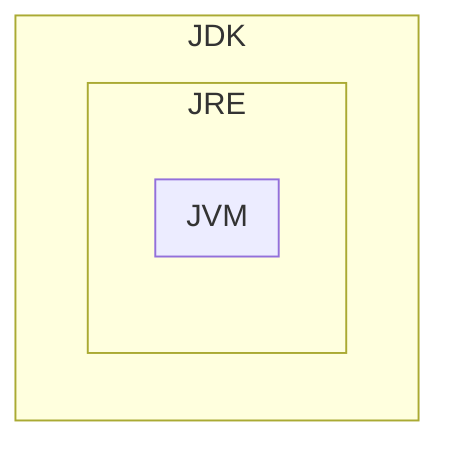

---
title: Taller 01: Instalación y uso de entornos de desarrollo
language: ES
author: David Martínez Peña [www.martinezpenya.es]
subject: Programación
keywords: [PRG, 2024, Programacion, Java]
IES: IES Eduardo Primo Marqués (Carlet) [www.ieseduardoprimo.es]
header: ${title} - ${subject} (ver. ${today}) 
footer:${currentFileName}.pdf - ${author} - ${IES} - ${pageNo}/${pageCount}
typora-root-url:${filename}/../
typora-copy-images-to:${filename}/../assets
---
[toc]
# Java

Cada software y cada entorno de desarrollo tiene unas características y funcionalidades específicas. Esto también se verá reflejado en la instalación y configuración del software. Dependiendo de la plataforma, entorno o sistema operativo en el que se vaya a instalar el software, se utilizará un paquete de instalación u otro, y habrá que tener en cuenta unas opciones u otras en su configuración.
A continuación se muestra cómo instalar una herramienta de desarrollo de software integrada, como Eclipse. Pero también podrás observar los procedimientos para instalar otras herramientas necesarias o recomendadas para trabajar con el lenguaje de programación JAVA, como Tomcat o la Máquina Virtual de Java.
Debes tener en cuenta los siguientes conceptos:

- La JVM (Java Virtual Machine, máquina virtual de Java) es la encargada de interpretar el bytecode y generar el código máquina del ordenador (o dispositivo) en el que se ejecuta la aplicación. Esto quiere decir que necesitamos una JVM distinta para cada entorno.
- JRE (Java Runtime Environment) es un conjunto de utilidades Java que incluye la JVM, las bibliotecas y el conjunto de software necesario para ejecutar aplicaciones cliente Java, así como el conector para que los navegadores de Internet ejecuten applets.
- JDK (Java Development Kit) es el conjunto de herramientas para desarrolladores; contiene, entre otras cosas, el JRE y el conjunto de herramientas necesarias para compilar el código, empaquetarlo, generar documentación...




El proceso de instalación consta de los siguientes pasos:
1. Descargue, instale y configure el JDK.
2. Descargue e instale un servidor web o de aplicaciones.
3. Descargue, instale y configure el IDE (Netbeans o Eclipse).
4. Configurar JDK con IDE.
5. Configure el servidor web o de aplicaciones con el IDE instalado.
6. Si es necesario, instalación de conectores.
7. Si es necesario, instale un nuevo software.


## Descargue e instale el JDK

Podemos diferenciar entre:

- Java SE (Java Standard Edition): es la versión estándar de la plataforma, siendo esta plataforma la base para todos los entornos de desarrollo Java ya sea de aplicaciones cliente, de escritorio o web.

- Java EE (Java Enterprise Edition): esta es la versión más grande de Java y generalmente se utiliza para crear grandes aplicaciones cliente/servidor y para el desarrollo de servicios web.

En este curso se utilizarán las funcionalidades de Java SE.
El archivo es diferente según el sistema operativo donde se tenga que instalar. Así:

- Para los sistemas operativos Windows y Mac OS hay un archivo instalable.
- Para los sistemas operativos GNU/Linux que admiten paquetes .rpm o .deb, también están disponibles paquetes de este tipo.
- Para el resto de sistemas operativos GNU/Linux existe un archivo comprimido (terminado en .tar.gz).

En los dos primeros casos, simplemente hay que seguir el procedimiento de instalación habitual del sistema operativo con el que estamos trabajando.
En este último caso, sin embargo, hay que descomprimir el archivo y copiarlo en la carpeta donde se desea instalar. Normalmente, todos los usuarios tendrán permisos de lectura y ejecución en esta carpeta.

> ### A partir de la versión 11 de JDK, Oracle distribuye el software con una licencia significativamente más restrictiva que las versiones anteriores. En particular, solo se puede utilizar para "desarrollar, probar, crear prototipos y demostrar sus aplicaciones". Cualquier uso "para fines comerciales, de producción o empresariales internos" distinto del mencionado anteriormente queda explícitamente excluido.
>
> Si lo necesitas para alguno de estos usos no permitidos en la nueva licencia, además de las versiones anteriores del JDK, existen versiones de referencia de estas versiones licenciadas "GNU General Public License version 2, with the Classpath Exception", que permiten la mayoría de los usos habituales. Estas versiones están enlazadas a la misma página de descarga y también a la dirección jdk.java.net.

Una alternativa es utilizar https://adoptium.net/ antes conocido como adoptOpenJDK, que ahora se ha integrado en la fundación Eclipse. Desde allí podemos descargar los binarios de la versión openJDK para nuestra plataforma sin restricciones. [Noticia completa] (https://es.wikipedia.org/wiki/OpenJDK).


> #### En GNU/Linux podemos utilizar los comandos:

>
> - `sudo apt install default-jdk` para instalar el jdk predeterminado.

> - `java --version` para ver las versiones disponibles en nuestro sistema.

> - `sudo update-alternatives --config java` para elegir cuál de las versiones instaladas queremos usar por defecto o incluso ver la ruta de las diferentes versiones que tenemos instaladas.

##Configurar las variables de entorno "JAVA_HOME" y "PATH"

Una vez descargado e instalado el JDK, debes configurar algunas variables de entorno:

- La variable `JAVA_HOME`: indica la carpeta donde se ha instalado el JDK. No es obligatorio definirla, pero es muy cómodo hacerlo, ya que muchos programas buscan en ella la ubicación del JDK. Además, resulta muy fácil definir las dos variables siguientes.

- La variable `PATH`. Debe apuntar al directorio que contiene el ejecutable de la máquina virtual. Suele ser la subcarpeta `bin` del directorio donde hemos instalado el JDK.

**Variable CLASSPATH**
Otra variable que tiene en cuenta el JDK es la variable `CLASSPATH`, que apunta a las carpetas donde se encuentran las librerías de la aplicación que se quiere ejecutar con el comando java. Es preferible, no obstante, indicar la ubicación de estas carpetas con la opción `-cp` del mismo comando java, ya que cada aplicación puede tener diferentes librerías y las variables de entorno afectan a todo el sistema.
Establecer la variable `PATH` es esencial para que el sistema operativo encuentre los comandos JDK y pueda ejecutarlos.

# IntelliJ

**IntelliJ IDEA** es un entorno de desarrollo integrado (IDE) escrito en Java para desarrollar software informático escrito en Java, Kotlin, Groovy y otros lenguajes basados ​​en JVM. Está desarrollado por JetBrains (antes conocido como IntelliJ) y está disponible como una edición comunitaria con licencia Apache 2 y en una edición comercial propietaria. Ambas se pueden utilizar para el desarrollo comercial.

Nuestra institución dispone de licencias para nuestros alumnos mientras tengáis correo electrónico @ieseduardoprimo.es.

## Instalación

Descargue desde https://www.jetbrains.com/idea/ la versión de la herramienta toolbox correspondiente a su sistema operativo.

Siga las instrucciones para su sistema operativo desde https://www.jetbrains.com/help/idea/installation-guide.html#toolbox

Una vez instalada la caja de herramientas, puede elegir instalar todos los productos de JetBrains.

Una vez instalada la Idea (IDE) puedes crear una entrada de escritorio desde la pantalla inicial:


Y en la opción Administrar licencias debes seguir estas instrucciones: https://www.jetbrains.com/help/license_server/Activating_license.html

La dirección del servidor es: https://iesepm.fls.jetbrains.com/

## Ajustes

Documentos para configurar su IDE: https://www.jetbrains.com/help/idea/configuring-project-and-ide-settings.html

## Módulos

Puedes agregar complementos siguiendo estas instrucciones:

https://www.jetbrains.com/help/idea/managing-plugins.html

## Uso básico ("¡Hola mundo!")

Los documentos te ayudan con tu primer programa en Java: https://www.jetbrains.com/help/idea/creating-and-running-your-first-java-application.html

Mucha más información:

- Si vienes de Eclipse: https://www.jetbrains.com/help/idea/migrating-from-eclipse-to-intellij-idea.html
- Si estuvieras en NetBeans: https://www.jetbrains.com/help/idea/netbeans.html
- Si quieres aprender por tu cuenta: https://www.jetbrains.com/help/idea/product-educational-tools.html

# Por qué debería elegir IntelliJ en lugar de VsCode para la codificación en Java

## **IDEA INTELIGENTE:**

**Ventajas:**

1. **Entorno integrado completo:** IntelliJ IDEA está diseñado específicamente para el desarrollo de Java y ofrece un conjunto completo de herramientas y características optimizadas para esta tarea.

2. **Análisis estático avanzado:** Proporciona un análisis de código en profundidad que detecta errores y problemas potenciales antes de la compilación.

3. **Depuración avanzada:** ofrece un potente conjunto de herramientas de depuración que ayudan a identificar y resolver problemas en el código.

4. **Refactorización guiada:** Proporciona herramientas para reorganizar y optimizar el código de forma segura, promoviendo buenas prácticas de programación.

5. **Compatibilidad con marcos y tecnologías Java:** Integración nativa con muchos marcos y tecnologías utilizados en el desarrollo Java, lo que facilita la creación de aplicaciones completas.

6. **Generación automática de código:** ayuda a los programadores a generar automáticamente fragmentos de código repetitivos, como captadores y definidores.

7. **Integración con herramientas de compilación:** facilita la integración con herramientas de compilación como Maven y Gradle.

8. **Soporte para pruebas unitarias:** Ofrece integración con marcos de prueba como JUnit para el desarrollo basado en pruebas.

9. **Facilidad de configuración:** Proporciona asistentes guiados para configurar de manera eficiente proyectos Java.

**Contras:**

1. **Mayor consumo de recursos:** Debido a su naturaleza integral y rica en funciones, IntelliJ IDEA puede consumir más recursos del sistema en comparación con IDE más livianos.

2. **Curva de aprendizaje:** Dado que ofrece una amplia gama de funciones, los principiantes pueden tardar un tiempo en familiarizarse con todas las herramientas disponibles.

## **Código de Visual Studio (VSCode):**

**Ventajas:**

1. **Ligero y rápido:** VSCode es un editor de código liviano y rápido, lo que lo hace ideal para proyectos más pequeños o para aquellos que prefieren una experiencia más ágil.

2. **Amplia gama de extensiones:** Tiene una amplia comunidad que desarrolla extensiones para diversas tecnologías y lenguajes, incluido Java.

3. **Versatilidad:** Si bien no está diseñado específicamente para Java, se puede personalizar para que funcione con Java a través de extensiones.

4. **Integración de control de versiones:** ofrece integración nativa con sistemas de control de versiones como Git.

5. **Curva de aprendizaje rápida**: Debido a su enfoque más ligero, puede resultar más sencillo para los principiantes comenzar a trabajar con él.

**Contras:**

1. **Funcionalidad limitada de Java:** Aunque existen extensiones de Java, VSCode no ofrece el mismo conjunto completo de herramientas optimizadas para Java que IntelliJ IDEA.

2. **Análisis menos profundo:** Las capacidades de análisis estático y corrección de código podrían no ser tan avanzadas como las de IntelliJ IDEA.

3. **Depuración limitada:** si bien ofrece depuración, es posible que no sea tan avanzada o completa como la de IntelliJ IDEA.

4. **Configuración manual del proyecto:** La configuración de proyectos Java puede requerir más pasos y configuración manual en comparación con IntelliJ IDEA.

# Tarea

Debes entregar un documento `*.pdf` explicando:

Una captura de pantalla en la que se vea el resultado del comando:

- ```java
  java --version
  ```

Y también capturas de pantalla donde se pueda ver que editas el fichero fuente (`HolaMundo.java`), lo compilas y lo ejecutas dentro del IDE IntelliJ (explica los pasos que has seguido)

# Fuentes de información

- [Wikipedia](https://es.wikipedia.org)
- [Code&Coke (Fernando Valdeón)](http://entornos.codeandcoke.com/doku.php?id=start)
- Apuntes IES El Grao (Mª Isabel Barquilla?)
- [Apuntes IOC (Marcel García)](https://ioc.xtec.cat/materials/FP/Recursos/fp_dam_m05_/web/fp_dam_m05_htmlindex/index.html)
- [Apuntes José Luis Comesaña](https://www.sitiolibre.com/)
- [Apuntes IES Luis Vélez de Guevara 17-18 (José Antonio Muñoz Jiménez)](http://jamj2000.github.io/slides/2017/09/05/entornosdesarrollo/)
- https://www.jetbrains.com
- ChatGPT

