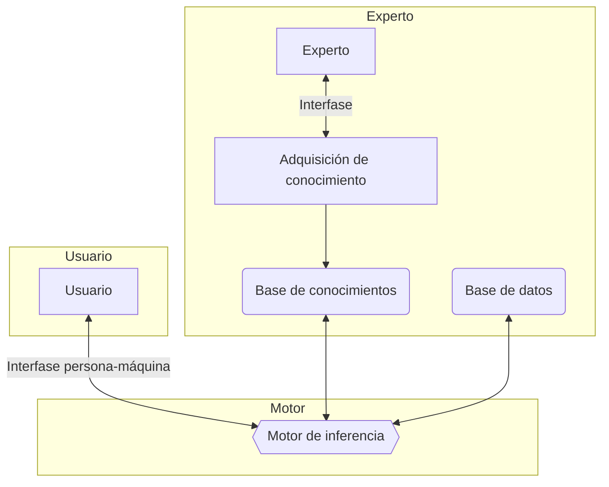
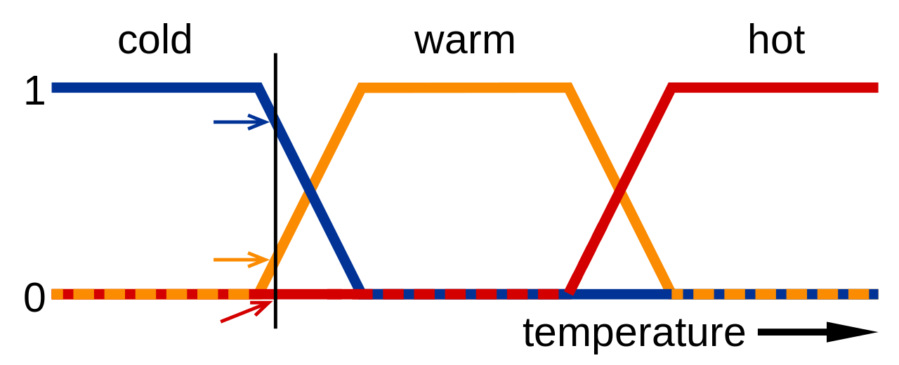
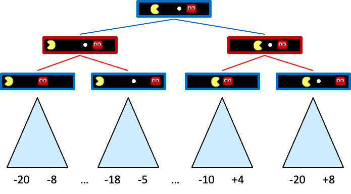
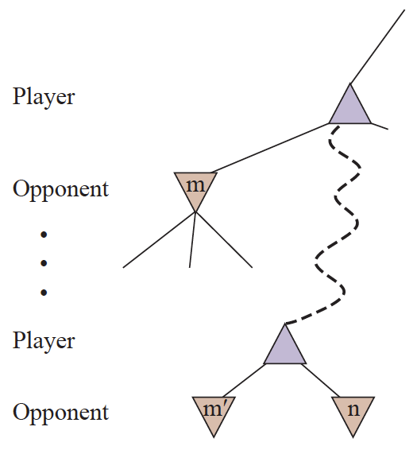

---
title: UD02: Sistemas Basados en Reglas
language: ES
author: www.martinezpenya.es
subject: Modelos de Inteligencia Artificial
keywords: [MIA, 2024, Modelos de Inteligencia Artificial, Curso Especialización IA-BD]
IES: www.ieseduardoprimo.es
header: ${title} - ${subject} (ver. ${today}) 
footer:${currentFileName}.pdf - ${author} - ${IES} - ${pageNo}/${pageCount}
typora-root-url:${filename}/../
typora-copy-images-to:${filename}/../assets
---
[toc]

# Inteligencia Artificial Simbólica

* **IA simbólica** o **IA basada en conocimiento**:
  * Extraemos conocimiento de expertos y lo representamos de una forma que las máquinas puedan entender.
  * Utilizamos este conocimiento para:
    * Resolver problemas automáticamente.
    * Explicar el razonamiento de la máquina.
    * Aprender nuevas cosas.
    * Mejorar el conocimiento existente.

## Representación del conocimiento

* Conocimiento $vs$ datos $vs$ información:
  * **Datos**: Hechos o valores.
  * **Información**: Datos con significado.
  * **Conocimiento**: Información con significado y estructura.

> # El conocimiento es un conjunto de información estructurada e interrelacionada que permite a un agente realizar tareas.

## Jerarquía del conocimiento


* Muchas veces definimos el conocimiento en relación a conceptos similares.
* La jerarquía del conocimiento o jerarquía de **DIKW** es un modelo que muestra la relación entre _datos_, _información_, _conocimiento_ y _sabiduría_.

* **Datos** (**D**ata): Hechos o valores registrados en un soporte físico. Es independiente del agente y puede ser interpretado de distintas formas.
  * Ejemplo: _"Un reloj inteligente registra la temperatura corporal de la persona."_

* **Información** (**I**nformation): Es como los datos son interpretados por un agente. Es subjetiva y depende del agente.
  * Ejemplo: _"La temperatura corporal de la persona es 37ºC"_

* **Conocimiento** (**K**nowledge): Es información integrada en nuestro modelo del mundo. Depende del agente y de sus conocimientos previos.
  * Ejemplo: _"Si la temperatura es superior a 37ºC, entonces la persona tiene fiebre"_

* **Sabiduría** (**W**isdom): Representa el meta-conocimiento: conocimiento sobre cómo y cuándo aplicar el conocimiento.
  * Ejemplo: _"Si la persona tiene fiebre, entonces debe tomar paracetamol"_

## Representación del conocimiento

* Es la forma en la que representamos el conocimiento para que las máquinas puedan entenderlo.
* Es uno de los problemas fundamentales de la inteligencia artificial.
* Se debe representar de forma que:
  * Sea **entendible** para las máquinas.
  * Sea **útil** para resolver problemas.
  * Sea **eficiente** para ser procesado por las máquinas.
* Podemos ver las diferentes representaciones como un **continuum**:
  * A la izquierda tenemos las representaciones más **simples** (algoritmos); utilizables por los ordenadores de forma eficiente pero muy poco flexibles.
  * A la derecha tenemos las representaciones más **flexibles** (texto natural); muy potentes pero no utilizables directamente por las máquinas.


* **Representaciones de red**:
  * En la mente humana el conocimiento se representa como una red de conceptos interrelacionados.
  * Las representaciones de red intentamos hacer lo mismo en un grafo dentro de los ordenadores.
    * Las llamamos **redes semánticas**.
  * Hay diferentes tipos: Pares de atributos y valores, representaciones jerárquicas, representaciones procedurales, lógica, etc.

## Pares de atributos y valores o tripletes objeto-atributo-valor

* Aprovechamos que un grafo se puede representar como una lista de nodos y aristas para representar el conocimiento.
* El conocimiento se representa como una lista de pares de atributos y valores.
  * _"El perro es un animal, el perro tiene cuatro patas, el perro tiene pelo, el perro tiene cola, etc."_
  * _"La paloma es un animal, la paloma es un pájaro, la paloma tiene dos patas, etc."_
  * _"El coche es un vehículo, el coche tiene cuatro ruedas, el coche tiene un motor, etc."_

## Representaciones jerárquicas

* El conocimiento se representa como un árbol.
* Los nodos del árbol representan conceptos.
* Las aristas representan relaciones entre conceptos.
  * Animales $$\rightarrow$$ Vertebrados $$\rightarrow$$ Mamíferos $$\rightarrow$$ Perros $$\rightarrow$$ Caniche
  * Animales $$\rightarrow$$ Vertebrados $$\rightarrow$$ Pájaros $$\rightarrow$$ Palomas $$\rightarrow$$ Paloma común
  * Objetos $$\rightarrow$$ Vehículos $$\rightarrow$$ Coches $$\rightarrow$$ Coche de gasolina

## Representaciones procedurales

* El conocimiento se representa como un conjunto de acciones que se pueden realizar cuando se dan ciertas condiciones.
* Llamamos **reglas de producción** a las **declaraciones** que nos permiten obtener conclusiones a partir de ciertas premisas.
* Son de la forma: **IF** (premisa) **THEN** (conclusión)
  * **IF** (la temperatura es superior a 37ºC) **THEN** (la persona tiene fiebre)
  * **IF** (la persona tiene fiebre) **THEN** (la persona debe tomar paracetamol)

## Lógica

* La lógica es un sistema formal que nos permite representar el conocimiento y razonar sobre él.
* La propuso Aristóteles hace más de 2000 años como herramienta para la **deducción**.
* La lógica proposicional es un sistema formal que nos permite representar el conocimiento y razonar sobre él.
* A nivel teórico es muy potente pero no es directamente utilizable por las máquinas.
  * Un subconjunto de la lógica es utilizable en sistemas como prolog.
* Ej: $p$: "La persona tiene fiebre", $$q$$: "La persona debe tomar paracetamol"
  * $$p \rightarrow q$$: "Si la persona tiene fiebre, entonces la persona debe tomar paracetamol"
  * $$p \land q$$: "La persona tiene fiebre y la persona debe tomar paracetamol"


# Sistemas Expertos

Los sistemas expertos son una aplicación de la inteligencia artificial que hacen uso de conocimientos especializados previamente adquiridos por el ser humano. Los sistemas expertos comenzaron su desarrollo en la década de 1970 y fueron muy populares tanto en esa década como en los años 80 del siglo pasado.

Se considera que los primeros sistemas de inteligencia artificial que fueron capaces de obtener resultados con utilidad práctica fueron los expertos. Se trata de sistemas basados fundamentalmente en reglas. Para el desarrollo de un sistema experto, resulta imprescindible disponer del conocimiento de un especialista en el campo objeto de estudio. Es decir, es necesario contar con información relativa a cómo un especialista trataría el problema propuesto. A los sistemas expertos se les denomina también por ese motivo «sistemas basados en conocimientos», o «sistemas basados en reglas».

> ### Todo sistema experto ha de tener la capacidad de explicar cuál es la decisión que ha tomado.

Un sistema experto se puede definir como un software que es capaz de simular el proceso de decisión que tomaría un experto humano en cierto campo. Por tanto, los sistemas expertos se diseñan de manera que puedan tomar de forma automática decisiones como si fueran expertos. Además, cabe señalar que todo sistema experto debe ser capaz de explicar la decisión que ha tomado y también ha de ser capaz de aprender cuando se le facilita nueva información.

## Estructuras elementales de los sistemas expertos

La arquitectura más común de los sistemas expertos es la del sistema basado en reglas. Este tipo de sistemas emplea expresiones del tipo:

«SI ... ENTONCES»

Cada regla representa una porción del conocimiento que se pretende introducir en el sistema. Un conjunto de reglas relacionadas puede llevar de una serie de hechos y datos conocidos hasta algunas conclusiones de utilidad.

Todo sistema experto está formado por los siguientes elementos:

- Interfaz de usuario y de comunicación externa.
- Base de datos de conocimiento.
- Motor de inferencias.
- Sistema para la explicación de las decisiones tomadas.
- Sistema para la adquisición de nuevo conocimiento.



###  Interfaz de usuario y de comunicación externa

Es el medio o vía para las consultas. Debe facilitar una comunicación lo más natural para el usuario, ser sencilla de aprender a utilizar y alertar de posibles datos erróneos de entrada. Los resultados deben ser claros y comprensibles para el usuario. Para conseguir esto, lo habitual ha sido contar con herramientas de desarrollo de interfaces gráficas, e implementar un módulo de comunicaciones y otro de explicaciones.

El módulo de comunicaciones está más enfocado en la interacción con otros sistemas, concretamente, en los casos de automatización de tareas o procesos, como en el caso de robótica industrial.

El módulo de explicación ayuda al ingeniero de conocimiento a refinar el motor de inferencia y al experto a verificar la coherencia de la base de conocimiento. Por otro lado, es el módulo que se encarga de mostrar al usuario el proceso aplicado a la resolución del problema o consulta.

En todo sistema experto resulta importante disponer de una interfaz de usuario que permita una comunicación cómoda del mismo con la aplicación. Toda interfaz hará uso bien de texto, de gráficos o de una combinación de ambos.

Dadas las características fundamentales comunes a todo sistema experto, es imprescindible que el usuario pueda responder de manera cómoda a las preguntas que el sistema le plantee a lo largo del proceso de resolución del problema.

Además, las conclusiones alcanzadas por el sistema serán mostradas al usuario a través de la interfaz.

Dentro de la interfaz se ha de tener en cuenta la parte dedicada a la comunicación externa, dado que resulta altamente probable que el sistema tenga que hacer uso de datos externos al mismo.

### Base de datos de conocimiento

Contiene el conocimiento y la experiencia de los expertos en un campo determinado, estructurado y codificado, preparado para entregar dicho conocimiento cuando sea requerido por el sistema. Ha sido generado a partir de las referencias dadas por los expertos en dicho campo.

El conocimiento puede estar organizado mediante listas, descripción de objetos relacionados con el problema en estudio, cálculo de predicados, redes semánticas y las relaciones o reglas de producción entre ellos. También se considera importante que estén los procedimientos de aplicación de dicho conocimiento en función del problema a resolver.

Para la creación de la base de datos de un sistema experto se necesitará contar con la participación de personas con experiencia que sean capaces de codificar sus conocimientos como reglas de la forma:

```lisp
SI <antecedente> ENTONCES <consecuencia>
```

En algunos casos, una regla puede tener múltiples antecedentes que se unen mediante conectores como O e Y. Este tipo de regla se denomina regla compuesta.

La estructura de una regla compuesta es la que se muestra a continuación:

```lisp
SI <antecedente1> Y <antecedente2>
	ENTONCES <consecuencia>
SI <antecedente1> O <antecedente2>
	ENTONCES <consecuencia>
```

Por tanto, las reglas constituyen la forma más común de codificar el conocimiento adquirido por un experto.

> #### Se pretende construir un sistema experto que decida si se concede o no un crédito al consumo a cierto cliente. Este sistema experto debe trabajar como lo haría un bancario acostumbrado a dicha operación.
>
> Un bancario con experiencia indica que únicamente se conceden este tipo de créditos a mayores de 18 años que dispongan de nómina y cuyo contrato sea bien de carácter indefinido o que la duración del mismo sea superior al tiempo necesario para la devolución de todas las cuotas del préstamo.
>
> Este conocimiento se podría expresar como:
>
> ```SI (cliente mayor de 18 años)
> SI (cliente mayor de 18 años)
> Y (tiene nómina)
> Y (tiene contrato indefinido)
> O (la duración del contrato es superior al tiempo de devolución del préstamo)
> ENTONCES (conceder préstamo solicitado)
> ```
>
> Por tanto, si el único criterio que se emplea para la concesión de créditos al consumo es el indicado por el bancario, un sistema experto que tenga implementada la regla expuesta más arriba será capaz de gestionar la concesión de créditos obteniendo los mismos resultados.

A la hora de implementar un sistema experto, resulta conveniente tener en cuenta que el conocimiento que proporcionan los expertos se pueda clasificar en distintas categorías:

- En primer lugar, un tipo de conocimiento muy utilizado es el denominado conocimiento procedimental. Este conocimiento se refiere a la realización de alguna tarea que se lleva a cabo con el fin de, por ejemplo, mejorar el rendimiento de un sistema o de un proceso. Así, siempre que se disponga de conocimiento relativo a cómo resolver un problema paso a paso, dicho conocimiento se denominará procedimental.
- Existe también otro conocimiento que es del tipo objetivo y que se encuentra en los libros y manuales de una especialidad. Es el llamado conocimiento factual. Si bien es accesible por otras vías, resulta de utilidad implementarlo en un sistema experto dada la rapidez de acceso al mismo.
- Además, también hay otra clase que es la propia de cada experto, que noestá completamente basada en hechos objetivos y que no se encuentra enlos libros de texto. Este conocimiento se denomina conocimiento heurístico y su implementación en sistemas expertos resulta muy adecuada. Si se alimenta a un sistema experto con conocimientos de tipo heurístico, se puede conseguir que, por ejemplo, personal destinado a la realización de una tarea y con escasa experiencia en la misma tome decisiones similares a las que elegiría un experto.
- La representación del conocimiento en un sistema experto por reglas del tipo SI ... ENTONCES contribuye a hacer más sencilla su explicación pues son fácilmente entendibles tanto por los programadores del sistema como por sus usuarios. Nótese también que la base de datos de conocimiento contiene la información que empleará el motor de inferencia.

### Base de hechos o datos

Es la memoria de trabajo propiamente dicha. Consiste en una memoria temporal auxiliar que almacena variables de inicio, valores de variables intermedias y las variables de salida de la consulta.

En esta unidad, queda registrado todo el histórico de estados del sistema en la consulta.

Durante una consulta, el usuario introduce la información que se tiene del problema actual en la base de hechos y el sistema sincroniza ésta con el conocimiento que hay disponible al respecto en la base de conocimiento, de forma que se puedan deducir nuevos hechos. Para esto es necesario que las base de datos sean de tipo relacional.

### Motor o mecanismo de inferencia

Es la unidad lógica que aplica las reglas sobre la base de conocimientos a partir de las consultas, extrayendo conclusiones. Utiliza un método fijo de solución de problemas configurado imitando el proceso humano de los expertos para resolver ese tipo de problemas.

El motor de inferencias es el elemento del sistema experto encargado de realizar el razonamiento. Así, el motor de inferencias es capaz de generar nueva información a partir del contenido existente en la base de datos y, por tanto, de tomar decisiones y contribuir a la resolución de problemas reales.

El motor de inferencia determina las acciones que tendrán lugar, el orden en el que lo harán y la interacción entre las distintas partes del sistema. También selecciona las reglas a aplicar y determina cómo y cuándo se van a aplicar las reglas programadas. Finalmente, también se encarga de la interacción con el usuario.

### Sistema para la explicación de las decisiones tomadas

Una vez que el motor de inferencias ha llegado una decisión, resulta de gran importancia que el sistema sea capaz de explicárselo de forma conveniente al usuario. Una manera de hacerlo es mostrando las reglas de inferencia que el sistema empleó en su proceso de razonamiento. Sin embargo, este método podría ser, en función de la aplicación de que se trate, sumamente tedioso.

Por tanto, todo sistema experto debe disponer de algún tipo de subsistema que permita presentar una explicación de las decisiones tomadas de manera que resulte comprensible para el usuario.

### Sistema para la adquisición de nuevo conocimiento

Es la parte del sistema que facilita la estructuración, implementación y actualización del conocimiento en las bases de datos. La clave es que sea una herramienta que se pueda utilizar sin tener un perfil especialmente técnico y sin tener que programar, aunque sí que debe permitir el acceso a través de código.

Se entiende por sistema de adquisición de nuevo conocimiento una interfaz que permita que un experto en el campo sea capaz de introducir nueva información en el sistema. Dada la naturaleza de los sistemas expertos, es necesario que, una vez puesto en operación, resulte posible seguir añadiendo nueva información a medida que sea necesario y, para ello, es imprescindible disponer de algún sistema que permita la adquisición de este conocimiento.

## Dinámica de un sistema experto.

El objetivo de los sistemas basados en el conocimiento es hacer que la información crítica requerida para que el sistema funcione sea explícita en lugar de implícita. En un programa informático tradicional, la lógica está incrustada en un código que, por lo general, solo puede ser revisado por un especialista informático. Con un sistema experto, el objetivo era especificar las reglas en un formato que fuera intuitivo y fácil de entender, revisar e incluso editar por expertos en el dominio en lugar de expertos en TI. Los beneficios de esta representación del conocimiento explícita fueron el desarrollo rápido y la facilidad de mantenimiento.

Los sistemas expertos, con su capacidad para combinar información y reglas de actuación, han sido vistos como una de las posibles soluciones al tratamiento y recuperación de información, no sólo documental. La década de 1980 fue prolija en investigación y publicaciones sobre experimentos de este orden, interés que aún no ha disminuido.

Lo que diferencia a este tipo de sistemas de un sistema tradicional de recuperación de información es que este último sólo es capaz de recuperar lo que existe explícitamente, mientras que un sistema experto debe ser capaz de generar información no explícita, razonando con los elementos que se le dan. Pero la capacidad de los sistemas expertos en el ámbito de la recuperación de la información no se limita a la recuperación. Pueden utilizarse para ayudar al usuario, en selección de recursos de información, en filtrado de respuestas, etc. Un sistema experto puede actuar como un intermediario inteligente que guía y apoya el trabajo del usuario final.

Veamos ahora los tipos de sistemas expertos que se desarrollaron y cómo resolvieron las tareas clave que permitieron su funcionamiento.

### Tipos de sistemas expertos.

Existen, principalmente, tres tipos de sistemas expertos:

- **Basados en reglas previamente establecidas**: También conocidos como RBR (Rule Based Reasoning). Trabajan mediante la aplicación de reglas, comparación de resultados y aplicación de las nuevas reglas basadas en la situación modificada. Esta aplicación de reglas heurísticas se apoya principalmente en lo que se conoce como lógica difusa, para su evaluación y aplicación.

- **Basados en casos**: También conocidos como CBR (Case Based Reasoning). Se basan en el proceso de solucionar nuevos problemas según las soluciones de problemas anteriores. Este tipo de razonamiento se adapta al nuevo problema.

- **Basados en redes bayesianas**: Son los conocidos sistemas probabilísticos, que constituyen una herramienta bastante útil en la estimación de probabilidades de resultados en función de nuevas evidencias. Como su nombre indica, se utiliza el cálculo de la probabilidad según el Teorema de Bayes. 

  En esencia, consiste en un gráfico que representa un conjunto de variables conocidas y las relaciones de dependencia entre ellas a fin de inferir, es decir, estimar la probabilidad, de las variables no conocidas. Dadas sus características, este modelo resulta idóneo para la clasificación, la predicción o el diagnóstico.

  Por ejemplo, un sistema de riego automático que tuviese que decidir si regar o no en función de la probabilidad de que llueva o no, seguiría este esquema (que puedes encontrar en un [artículo](https://es.wikipedia.org/wiki/Red_bayesiana) más extenso sobre el tema).

> ## Te recomendamos que juegues con diferentes tipos de sistemas basados en reglas que puedes encontrar en esta [web](https://visiruleexamples.com/vregs.html).

### Representación del conocimiento.

Las estructuras básicas de representación del conocimiento son:

- **Reglas de producción**: El resultado que arroja un sistema experto se basa en la aplicación de reglas sobre los objetos y hechos presentes. Se trata de estructuras condicionales que relacionan a través de la lógica la información de una premisa o antecedente con la información contenida en la parte de conclusión o consecuencia y que suele traducirse en una acción. Tanto la premisa como la conclusión, hacen referencia a hechos mencionados en la base de conocimientos.

  El esquema de una regla de producción sería éste: 

  `SI premisa 1 Y premisa 2 ... Y premisa n ENTONCES conclusión/acción `

  Por ejemplo:

  `SI el reloj funciona Y el reloj marca las 7:00 ENTONCES es hora de levantarse/suena el despertador`

  Cuando se aplica una regla sobre unos hechos, se dice que la regla "dispara" y esto provoca la inserción de un nuevo hecho en la base de hechos.

- **Lógica proposicional**: Es similar a las reglas de producción. Separa los elementos que componen la base de conocimiento de aquellos que controlan la operación del sistema.

- **Redes semánticas**: Representan el conocimiento en formas de redes o grafos. Cada nodo de la red representa un concepto u objeto y los lazos que los interconectan describen reacciones entre ellos.

  

- **Marcos**: Son estructuras de datos donde se almacena información concreta de un cierto concepto y la información relacional correspondiente. Asocian propiedades a los nodos de las redes semánticas, que representan, a su vez, los objetos o conceptos. Dichas propiedades son descritas en términos de atributos y valores asociados.
- **Objetos**: Se utilizan, especialmente, en entornos de programación orientada a objetos y actúan como entidades independientes de forma que el control del sistema se materializa a través del envío de mensajes del sistema a los objetos y entre ellos mismos.

- **Representaciones múltiples**: Son de uso frecuente y combinan dos o más formas de representación entre éstas:
  - **Representación declarativa**: incluye las reglas, el cálculo de predicados y las redes semánticas. El conocimiento queda estructurado en fragmentos independientes entre sí que se combinan mediante un mecanismo general de razonamiento y deducción.
  - **Representación procedimental**: refleja explícitamente las relaciones entre los fragmentos de conocimiento, y éstas son difíciles de modificar
  - **Representación mixta**: es una combinación de las anteriores. Usa objetos y marcos.

### Mecanismos de razonamiento.

Los principales mecanismos o modos de razonamiento son:

- Encadenamiento hacia delante: se parte de hechos para llegar a resultados.
- Encadenamiento hacia atrás: se parte de los resultados y se trata de encontrar o volver a los hechos.
- Encadenamiento mixto: combina los anteriores.
- Algoritmo de búsqueda heurística: el proceso de inferencia es una búsqueda en una estructura de tipo árbol.
- Herencia: usado en entornos de programación orientada a objetos. Un objeto hijo hereda propiedades y hechos de los padres.

Para obtener conclusiones, utilizaremos los diferentes tipos de reglas y estrategias de inferencia y control. Te recomendamos empezar por considerar las más básicas como son **Modus Ponens** y **Modus Tollens** como sistemas de inferencia y el **encadenamiento de reglas hacia adelante** y **encadenamiento de reglas hacia atrás** como estrategias de inferencia.

> ## Para conocer mejor los sistemas de inferencia **Modus Ponens** y **Modus Tollens**, puedes recurrir a sus correspondientes artículos en la Wikipedia:
>
> - [Modus Ponens](https://es.wikipedia.org/wiki/Modus_ponendo_ponens) "si *P* implica *Q; y* si *P* es verdad; entonces *Q* también es verdad."
> - [Modus Tollens](https://es.wikipedia.org/wiki/Modus_tollendo_tollens) "Si *P* implica *Q*, y *Q* no es cierto, entonces *P* no es cierto"
>
> Así como ver este [vídeo](https://youtu.be/MLe9flR4PsA) corto en el que se hace un planteamiento sencillo de los conceptos.

> ## Encadenamiento hacia adelante y hacia atrás
>
> [](https://prezi.com/fvw2aokvct7r/encadenamiento-hacia-adelante-y-hacia-atras/)

# Sistemas híbridos Reglas/Datos

* Dos enfoques:
  * Deducción de reglas a partir de datos.
    * Facilita la **interpretación** del razonamiento.
  * Integración de reglas definidas por el usuario y Aprendizaje Automático.
    * Permite definir unas reglas que se pueden **mejorar** con el aprendizaje automático.


## Librerías

* [Human-Learn](https://koaning.github.io/human-learn/index.html):
  * Permite definir y dibujar reglas que se pueden mejorar con el aprendizaje automático.
* [skope-rules](https://github.com/scikit-learn-contrib/skope-rules):
  * Analiza los datos y deduce reglas para clasificar.
  * Permite analizar las reglas para mejorarlas e interpretarlas.
* [SpaCy](https://spacy.io/usage/rule-based-matching):
  * Permite definir reglas para la extracción de información para textos.
  * Útil en casos donde no se dispone de suficientes datos etiquetados o por casos específicos.

# Sistemas de razonamiento impreciso



## Definición

* **Lògica difusa** o **lògica borrosa**:
  * Extensión de la lógica proposicional para trabajar con la incertidumbre.
  * Permite trabajar con valores imprecisos.
* **Sistemas de razonamiento impreciso**:
  * Sistemas basados ​​en reglas que utilizan la lógica difusa.
  * Permiten trabajar con valores **continuos**.
  * Facilitan modelar el **conocimiento humano**.
  * Muy apropiados para **sistemas de control**
  * Nos permiten tener una **buena** solución, si no la **mejor**.

## Lógica difusa

* La lógica proposicional es **binaria**.
  * Un enunciado es **cierto** o **falso**.
* La lógica difusa permite trabajar con valores **continuos**.
  * Un enunciado puede ser **cierto** _i_ **falso** en un grado **parcial**.
* Los valores de verdad son **números reales** en el intervalo $$[0, 1]$$.
  * $$0: Falso$$, $$1: Cierto$$, $$0.5:$$ $$Cert$$ en un $$50\%$$
* La pertenencia de un elemento a un conjunto vendrá dada por una **función de pertenencia**.
  * $$\mu_A(x)$$: Grado de pertenencia de $$x$$ al conjunto $$A$$.


* La lógica difusa facilita la **representación del conocimiento humano**.
  * Los humanos no razonamos en términos binarios.
  * Los humanos no tenemos un conocimiento preciso ni completo.
* Conceptos como $$húmedo$$ o $$fred$$ son difíciles de definir con precisión.
  * La lógica difusa nos permite definirlos con **funciones de relevancia**.
  * El poder trabajar con estos conceptos facilita la creación de dispositivos como secadores o termostatos.
    * _"Si la temperatura es fría, entonces enciende la calefacción"_

## Conceptos básicos

* **Variable lingüística**: Variable que puede tomar valores lingüísticos.
  * Ejemplos: $$Temperatura$$
* **Valores lingüísticos**: Valores que puede tomar una variable lingüística.
  * Ejemplo: $$Frío, Calor$$
* **Función de pertenencia**: Función que asigna a cada valor de una variable lingüística un grado de pertenencia a un valor lingüístico.
  * Ejemplo: $$Temperatura = 27^ºC \rightarrow Calor = 0.8,\; Combustible\,Calor = 0,2$$

* **Regla difusa**: Regla que utiliza valores difusos.
  * Ejemplo: _"Si la temperatura es **fría**, entonces **calefacción alta**"_
* **Función de agregación**: Función que combina los valores difusos de las reglas para deducir la conclusión final.
  * Exemple: $$Calor = 0.8, Humedo = 0.7 \rightarrow Sensación\:desagradable = 0.8$$
* **Sistema de razonamiento impreciso**:
  * Sistema basado en reglas que utiliza la lógica difusa.
  * Ejemplo: Sistema de control de temperatura de una casa.

## Funcionamiento de los sistemas de razonamiento impreciso

* _Fuzzyficación_:
  * Conversión de los datos de entrada precisos a valores difusos.
  * Pasamos de valores precisos a valores difusos.
  * Utiliza las **funciones de pertenencia**.
    * Asigne a cada valor de entrada un grado de relevancia para cada **variable de idioma**
    * $$27^oC \rightarrow Calor = 0.8, Mucha\:calor = 0.2$$

* _Evaluación de las reglas_:
  * En este paso se **aplican las reglas del sistema**.
  * Se establece la relación entre las **variables de entrada** y las **variables de salida**.
  * _"Si la temperatura es **alta** y la humedad es **baja**, entonces la velocidad del ventilador debe ser **alta**"_
  * Las **funciones de relevancia** de las **variables de entrada** se combinan
    * para deducir la **relevancia** de la variable de **salida**.



* _Desfuzzyficación_:
  * Conversión de los datos de salida difusos a valores precisos.
  * Pasamos de valores difusos a valores precisos.
  * Utiliza las **funciones de agregación**.
    * Combina las conclusiones de las reglas para deducir la conclusión final.
    * Se suele utilizar la función de **centro de gravedad** o **máximo**.

## Funciones de pertenencia



* Las más utilizadas son las **funciones trapezoidales** y las **funciones triangulares**.
* Las sinusoidales son útiles para representar **periodos**.
* Las sigmoidales son útiles para representar **probabilidades**.

## Ejemplo: Propinas

### Variables d'entrada

Utilizaremos funciones triangulares para representar las variables de entrada y salida

* **Servicio**:
  * **Bajo**: $$[0, 5]$$
  * **Media**: $$[0, 10]$$
  * **Alta**: $$[5, 10]$$


* **Calidad de la comida**:
  * **Bajo**: $$[0, 5]$$
  * **Medio**: $$[0, 10]$$
  * **Todos**: $$[5, 10]$$

### Variables de salida

* **Soborno**:
  * **Bajo**: $$[0, 13]$$
  * **Media**: $$[0, 25]$$
  * **Alta**: $$[13, 25]$$


### Reglas

* **IF** (Calidad del servicio es **baja** o Comida es **bajo**) **THEN** (Propina es **baja**)
* **IF** (Calidad del servicio es **media**) **THEN** (Propina es **media**)
* **IF** (Calidad del servicio es **alta** o Comida es **alt**) **THEN** (Propina es **alta**)


### Inferencia

* Calidad del servicio: **9.8**
* Calidad de la comida: **6.5**
* Soborno: **20,24%**


> ## **Lógica difusa**
>
> Si quieres profundizar más en el tema de la lógica difusa o borrosa que permite la toma de decisiones en algunos sistemas expertos, puedes leer sobre ello en este [artículo de la Wikipedia](https://es.wikipedia.org/wiki/Lógica_difusa).


# Fuentes de información

- [Wikipedia](https://es.wikipedia.org)
- [GhatGPT](https://chat.openai.com)
- [Modelos de Inteligencia Artificial (Ed. Marcombo)](https://www.marcombo.com/modelos-de-inteligencia-artificial-9788426734419/)
- https://iep.utm.edu/artificial-intelligence/
- Materiales MIA curso MEC-20230524
- https://www.gartner.com/en/newsroom/press-releases/2021-09-29-gartner-finds-33-percent-of-technology-providers-plan-to-invest-1-million-or-more-in-ai-within-two-years
- https://rapidapi.com/blog/top-facial-recognition-apis/
- https://www.sciencedirect.com/science/article/pii/S0212656720301463
- <p xmlns:cc="http://creativecommons.org/ns#" xmlns:dct="http://purl.org/dc/terms/"><a property="dct:title" rel="cc:attributionURL" href="https://lawer.github.io/mia/">Models d'IA</a> de <span property="cc:attributionName">Carles Gonzalez</span> està sotmés a la llicència: <a href="https://creativecommons.org/licenses/by-nc-sa/4.0/?ref=chooser-v1" target="_blank" rel="license noopener noreferrer" style="display:inline-block;">Creative Commons Attribution-NonCommercial-ShareAlike 4.0 International</a></p> 
