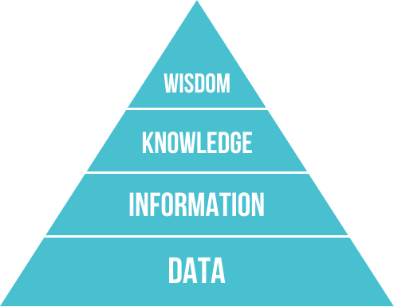
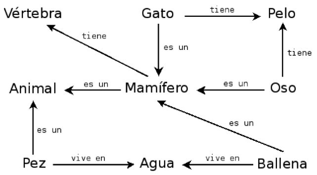

---
marp: true
style: pre.mermaid { all: unset; }
---
<!--
theme: gaia
size: 16:9
_class: lead
paginate: true
marp: false
backgroundColor: #000
backgroundImage: url('img/hero-backgroundIES.jpg')
-->
<style>
section::after {
  content: attr(data-marpit-pagination) '/' attr(data-marpit-pagination-total);}
img[alt~="center"] {
  display: block;
  margin: 0 auto;
}
table {
  margin-left: auto;
  margin-right: auto;
}
footer {
  font-size: 20px;
 }
header {
  font-size: 16px;
 }
</style>
<style scoped>
section {
  @extend .markdown-body;
  font-size: 28px;
  justify-content: top;
 }
</style>


# **UD02: Sistemas Basados en Reglas**
#### Modelos de Inteligencia Artificial
###### version: 2024-11-21
___
<!-- footer: d.martinezpena@edu.gva.es -->
<!-- header: Modelos de Inteligencia Artificial 24-25 (UD01_1)-->
# ¿Qué veremos?
1. IA Simbolica
2. Sistemas Expertos
3. Sistemas híbridos Reglas/Datos
4. Sistemas de razonamiento impreciso
___
## Inteligencia artificial simbólica

- **IA simbólica** o **IA basada en conocimiento**:
  - Extraemos conocimiento de expertos y lo representamos de una forma que las máquinas puedan entender.
  - Utilizamos este conocimiento para:
    - Resolver problemas automáticamente.
    - Explicar el razonamiento de la máquina.
    - Aprender nuevas cosas.
    - Mejorar el conocimiento existente.

---

## Representación del conocimiento

- Conocimiento vs datos vs información:
  - **Datos**: Hechos o valores.
  - **Información**: Datos con significado.
  - **Conocimiento**: Información con significado y estructura.

> El conocimiento es un conjunto de información estructurada e interrelacionada que permite a un agente realizar tareas.

---
## Jerarquía del conocimiento (I)
- Muchas veces definimos el conocimiento en relación a conceptos similares.
- La jerarquía del conocimiento o jerarquía de DIKW es un modelo que muestra la relación entre _datos_, _información_, _conocimiento_ y _sabiduría_.



---

## Jerarquía del conocimiento (II)

- **Datos** (**D**ata): Hechos o valores registrados en un soporte físico. Es independiente del agente y puede ser interpretado de diferentes maneras.

  - Ejemplo: _"Un reloj inteligente registra la temperatura corporal de la persona."_

- **Información** (**I**nformation): Es como los datos son interpretados por un agente. Es subjetiva y depende del agente.
  - Ejemplo: _"La temperatura corporal de la persona es 37ºC"_

---

## Jerarquía del conocimiento (III)

- **Conocimiento** (**K**nowledge): Es información integrada en nuestro modelo del mundo. Depende del agente y de sus conocimientos previos.

  - Ejemplo: _"Si la temperatura es superior a 37ºC, entonces la persona tiene fiebre"_

- **Sabiduría** (**W**isdom): Representa el meta-conocimiento: conocimiento sobre cómo y cuándo aplicar el conocimiento.
  - Ejemplo: _"Si la persona tiene fiebre, entonces debe tomar paracetamol"_

---

## Representación del conocimiento (I)

- Es la forma en la que representamos el conocimiento para que las máquinas puedan entenderlo.
- Es uno de los problemas fundamentales de la inteligencia artificial.
- Se debe representar de forma que:
  - Sea **entendible** para las máquinas.
  - Sea **útil** para resolver problemas.
  - Sea **eficiente** para ser procesado por las máquinas.

---

## Representación del conocimiento (II)

- Podemos ver las diferentes representaciones como un **continuum**:
  - A la izquierda tenemos las representaciones más **simples** (algoritmos); utilizables por los ordenadores de forma eficiente pero muy poco flexibles.
  - A la derecha tenemos las representaciones más **flexibles** (texto natural); muy potentes pero no utilizables directamente por las máquinas.

---

## Continuum del conocimiento


---

## Representación del conocimiento (III)

- **Representaciones de red**:
  - En la mente humana el conocimiento se representa como una red de conceptos interrelacionados.
  - Las representaciones de red intentamos hacer lo mismo en un grafo dentro de los ordenadores.
    - Las llamamos **redes semánticas**.
  - Existen diferentes tipos: Pares de atributos y valores, representaciones jerárquicas, representaciones procedurales, lógica, etc.

---

<style scoped>
section {
  @extend .markdown-body;
  font-size: 30px;
  justify-content: top;
 }
</style>
## Pares de atributos y valores o tripletes objeto-atributo-valor

- Aprovechamos que un grafo se puede representar como una lista de nodos y aristas para representar el conocimiento.
- El conocimiento se representa como una lista de pares de atributos y valores.
  - _"El perro es un animal, el perro tiene cuatro patas, el perro tiene pelo, el perro tiene cola, etc."_
  - _"La paloma es un animal, la paloma es un pájaro, la paloma tiene dos patas, etc."_
  - _"El coche es un vehículo, el coche tiene cuatro ruedas, el coche tiene un motor, etc."_

---

## Representaciones jerárquicas

- El conocimiento se representa como un árbol.
- Los nodos del árbol representan conceptos.
- Las aristas representan relaciones entre conceptos.
  - Animales $\rightarrow$ Vertebrados $\rightarrow$ Mamíferos $\rightarrow$ Perros $\rightarrow$ Caniche
  - Animales $\rightarrow$ Vertebrados $\rightarrow$ Pájaros $\rightarrow$ Palomas $\rightarrow$ Paloma común
  - Objetos $\rightarrow$ Vehículos $\rightarrow$ Coches $\rightarrow$ Coche de gasolina

---

## Representaciones procedurales

- El conocimiento se representa como un conjunto de acciones que pueden realizarse cuando se dan ciertas condiciones.
- Llamamos **reglas de producción** a las **declaraciones** que nos permiten obtener conclusiones a partir de ciertas premisas.
- Son de la forma: **IF** (premisa) **THEN** (conclusión)
  - **IF** (la temperatura es superior a 37ºC) **THEN** (la persona tiene fiebre)
  - **IF** (la persona tiene fiebre) **THEN** (la persona debe tomar paracetamol)

---

<style scoped>
section {
  @extend .markdown-body;
  font-size: 30px;
  justify-content: top;
 }
</style>

## Lógica

- La lógica es un sistema formal que nos permite representar el conocimiento y razonar sobre él propuesta por Aristóteles hace más de 2000 años como herramienta para la deducción.
- La lógica proposicional es un sistema formal que nos permite representar el conocimiento y razonar sobre él. Muy potente a nivel teórico pero no directamente utilizable por las máquinas; un subconjunto es utilizable en sistemas como prolog.
- Ej: $p$: "La persona tiene fiebre", $q$: "La persona debe tomar paracetamol"
  - $p \rightarrow q$: "Si la persona tiene fiebre, entonces la persona debe tomar paracetamol"
  - $p \land q$: "La persona tiene fiebre y la persona debe tomar paracetamol"
---
<style scoped>
section {
  @extend .markdown-body;
  font-size: 31px;
  justify-content: top;
 }
</style>
# 2. Sistemas Expertos
* Los sistemas expertos son una aplicación de la inteligencia artificial.
* Los sistemas expertos comenzaron su desarrollo en la década de 1970.
* Se considera que los primeros sistemas que fueron capaces de obtener resultados con utilidad práctica.
* Basados fundamentalmente en reglas. 
* imprescindible disponer del conocimiento de un especialista en el campo objeto de estudio.
  > Todo sistema experto ha de tener la capacidad de explicar cuál es la decisión que ha tomado.

<!--Un sistema experto se puede definir como un software que es capaz de simular el proceso de decisión que tomaría un experto humano en cierto campo. Por tanto, los sistemas expertos se diseñan de manera que puedan tomar de forma automática decisiones como si fueran expertos. Además, cabe señalar que todo sistema experto debe ser capaz de explicar la decisión que ha tomado y también ha de ser capaz de aprender cuando se le facilita nueva información.-->
___
# 2. Estructuras elementales de los sistemas expertos
* La arquitectura... basado en reglas del tipo: «SI ... ENTONCES»
* Cada regla representa una porción del conocimiento que se pretende introducir en el sistema. 
* Un conjunto de reglas relacionadas puede llevar de una serie de hechos y datos conocidos hasta algunas conclusiones de utilidad.
___
Todo sistema experto está formado por los siguientes elementos:

___
# 3.Dinámica de un sistema experto.
* En un programa informático, la lógica está incrustada en un código que,solo puede ser revisado por un especialista informático.
* En un sistema experto, el objetivo era especificar las reglas en un formato que fuera intuitivo y fácil de entender, revisar e incluso editar por expertos en el dominio en lugar de expertos en TI.
* Un sistema experto debe ser capaz de generar información no explícita, razonando con los elementos que se le dan.
* Un sistema experto puede actuar como un intermediario inteligente que guía y apoya el trabajo del usuario final.
___
## Tipos de sistemas expertos.
* **Basados en reglas previamente establecidas** <!-- También conocidos como RBR (Rule Based Reasoning). Trabajan mediante la aplicación de reglas, comparación de resultados y aplicación de las nuevas reglas basadas en la situación modificada. Esta aplicación de reglas heurísticas se apoya principalmente en lo que se conoce como lógica difusa, para su evaluación y aplicación.-->
* **Basados en casos** <!-- También conocidos como CBR (Case Based Reasoning). Se basan en el proceso de solucionar nuevos problemas según las soluciones de problemas anteriores. Este tipo de razonamiento se adapta al nuevo problema.-->
* [**Basados en redes bayesianas**](https://es.wikipedia.org/wiki/Red_bayesiana)<!--Son los conocidos sistemas probabilísticos, que constituyen una herramienta bastante útil en la estimación de probabilidades de resultados en función de nuevas evidencias. Como su nombre indica, se utiliza el cálculo de la probabilidad según el Teorema de Bayes. En esencia, consiste en un gráfico que representa un conjunto de variables conocidas y las relaciones de dependencia entre ellas a fin de inferir, es decir, estimar la probabilidad, de las variables no conocidas. Dadas sus características, este modelo resulta idóneo para la clasificación, la predicción o el diagnóstico. Por ejemplo, un sistema de riego automático que tuviese que decidir si regar o no en función de la probabilidad de que llueva o no, seguiría este esquema (que puedes encontrar en un [artículo](https://es.wikipedia.org/wiki/Red_bayesiana) más extenso sobre el tema).-->
* [**Lógica difusa**](https://es.wikipedia.org/wiki/Lógica_difusa)<!-- Si quieres profundizar más en el tema de la lógica difusa o borrosa que permite la toma de decisiones en algunos sistemas expertos, puedes leer sobre ello en este [artículo de la Wikipedia]-->
* Diferentes tipos de sistemas basados en reglas: [web](https://visiruleexamples.com/vregs.html).
___
<style scoped>
section {
  @extend .markdown-body;
  font-size: 27px;
  justify-content: top;
 }
</style>
## Representación del conocimiento.
* **Reglas de producción**<!--El resultado que arroja un sistema experto se basa en la aplicación de reglas sobre los objetos y hechos presentes. Se trata de estructuras condicionales que relacionan a través de la lógica la información de una premisa o antecedente con la información contenida en la parte de conclusión o consecuencia y que suele traducirse en una acción. Tanto la premisa como la conclusión, hacen referencia a hechos mencionados en la base de conocimientos.   Cuando se aplica una regla sobre unos hechos, se dice que la regla "dispara" y esto provoca la inserción de un nuevo hecho en la base de hechos.-->
* **Lógica proposicional**<!--Es similar a las reglas de producción. Separa los elementos que componen la base de conocimiento de aquellos que controlan la operación del sistema.-->
* **Redes semánticas**<!-- Representan el conocimiento en formas de redes o grafos. Cada nodo de la red representa un concepto u objeto y los lazos que los interconectan describen reacciones entre ellos.-->

  

- **Marcos**<!-- Son estructuras de datos donde se almacena información concreta de un cierto concepto y la información relacional correspondiente. Asocian propiedades a los nodos de las redes semánticas, que representan, a su vez, los objetos o conceptos. Dichas propiedades son descritas en términos de atributos y valores asociados.-->
- **Objetos**<!-- Se utilizan, especialmente, en entornos de programación orientada a objetos y actúan como entidades independientes de forma que el control del sistema se materializa a través del envío de mensajes del sistema a los objetos y entre ellos mismos.-->

- **Representaciones múltiples**<!--: Son de uso frecuente y combinan dos o más formas de representación entre éstas:-->
  - **Representación declarativa**<!--: incluye las reglas, el cálculo de predicados y las redes semánticas. El conocimiento queda estructurado en fragmentos independientes entre sí que se combinan mediante un mecanismo general de razonamiento y deducción.-->
  - **Representación procedimental**<!--: refleja explícitamente las relaciones entre los fragmentos de conocimiento, y éstas son difíciles de modificar-->
  - **Representación mixta**<!--: es una combinación de las anteriores. Usa objetos y marcos.-->
___
## Mecanismos de razonamiento.
* **Encadenamiento hacia delante**: se parte de hechos para llegar a resultados.
* **Encadenamiento hacia atrás**: se parte de los resultados y se trata de encontrar o volver a los hechos.
* **Encadenamiento mixto**: combina los anteriores.
* **Algoritmo de búsqueda heurística**: el proceso de inferencia es una búsqueda en una estructura de tipo árbol.
* **Herencia**: usado en entornos de programación orientada a objetos. Un objeto hijo hereda propiedades y hechos de los padres.
___
### [Encadenamiento hacia adelante y hacia atrás](https://prezi.com/fvw2aokvct7r/encadenamiento-hacia-adelante-y-hacia-atras/)

### Para obtener conclusiones...
* [Modus Ponens](https://es.wikipedia.org/wiki/Modus_ponendo_ponens) "si *P* implica *Q; y* si *P* es verdad; entonces *Q* también es verdad."
* [Modus Tollens](https://es.wikipedia.org/wiki/Modus_tollendo_tollens) "Si *P* implica *Q*, y *Q* no es cierto, entonces *P* no es cierto"

Así como ver este [vídeo](https://youtu.be/MLe9flR4PsA) corto en el que se hace un planteamiento sencillo de los conceptos.
___
<style scoped>
section {
  @extend .markdown-body;
  font-size: 27px;
  justify-content: top;
 }
</style>
# 4.Representación y simulación de comportamientos básicos
* Ventajas:
  * se programan de manera rápida (si...entonces)
  * manejan gran cantidad de información simultaneamente
  * son escalables, solo debemos alimentarlos con más información.
  * actuan de manera transparente y pedagógica
* Desventajas:
  * por mucha info que introduzcamos, imposible abarcar todo
  * no son creativos o imaginativos

* Aprenderemos más usando Experta en la parte práctica.
___
# 5.Estrategias de control de un sistema experto

* Las dos estrategias de control más empleadas:
  * **razonamiento hacia adelante**
  * **razonamiento hacia atrás**

* **LISP** normalmente utilizará razonamiento hacia adelante
* **PROLOG** empleará la estrategia de razonamiento hacia atrás.
___
#### razonamiento hacia adelante:
```lisp
SI (el paciente tiene fiebre) Y (ha perdido el olfato)
	ENTONCES hacer prueba PCR (Polymerase Chain Reaction)
```
```lisp
 SI (llueve)
 	ENTONCES (usar paraguas)
 ```
___
<style scoped>
section {
  @extend .markdown-body;
  font-size: 27px;
  justify-content: top;
 }
</style>
#### encadenamiento hacia atrás:
Se parte del estado de llegada y se trata de llegar a él encadenando objetivos. Se parte de un resultado que se considerará cierto en caso de cumplirse una serie de condiciones.
determinar qué animal caza ratones y bebe leche. La base de reglas de la que se dispone es la siguiente:
```lisp
SI Animal caza ratones y bebe leche
	ENTONCES Animal es un gato
SI Animal pía y vuela
	ENTONCES Animal es un pájaro
SI Animal es un gato
	ENTONCES Animal tiene pelo
SI Animal es un pájaro
	ENTONCES Animal es tiene plumas
```
El encadenamiento hacia atrás comienza con una lista de objetivos o una hipótesis y trabaja desde el consecuente hacia el antecedente con el fin de verificar si los datos apoyan las consecuencias.
___

## Sistemes híbrids Regles/Dades (I)

- Dos enfocaments:
  - Deducció de regles a partir de dades. - Facilita la **interpretació** del raonament.
  - Integració de regles definides per l'usuari i Aprenentatge Automàtic. - Permet definir unes regles que es poden **millorar** amb l'aprenentatge automàtic.


---

<style scoped>section { font-size:32px; }</style>

## Sistemas híbridos Reglas/Datos (II)

### Librerías

- [Human-Learn](https://koaning.github.io/human-learn/index.html): Permite definir y dibujar reglas que se pueden mejorar con el aprendizaje automático.
- [skope-rules](https://github.com/scikit-learn-contrib/skope-rules): Analitza les dades i dedueix regles per a classificar.
  - Permite analizar las reglas para mejorarlas e interpretarlas.
- [SpaCy](https://spacy.io/usage/rule-based-matching):
  - Permite definir reglas para extracción de información para textos.
  - Útil en casos donde no se dispone de suficientes datos etiquetados o por casos específicos.

---

<!--
_clase: plomo
-->

<estilo con ámbito>
h1, h2, h3, h4, h5, h6, p {
  peso de la fuente: 800;
  sombra de texto:
    0px 0px 3px #FFFFFF;
}
</estilo>

## Sistemas de razonamiento impreciso


---

<style scoped>sección { tamaño de fuente: 31px; }</style>

### Definición

- **Lògica difusa** o **lògica borrosa**:
  – Extensión de la lógica proposicional para trabajar con la incertidumbre.
  - Permite trabajar con valores imprecisos.
- **Sistemas de razonamiento impreciso**:
  - Sistemas basados ​​en reglas que utilizan la lógica difusa.
  - Permiten trabajar con valores **continuos**.
  - Facilitan modelar el **conocimiento humano**.
  - Muy apropiados para **sistemas de control**
  - Nos permiten tener una **buena** solución, si no la **mejor**.

---

<style scoped>sección { tamaño de fuente: 32px; }</style>

### Lógica difusa (I)

- La lógica proposicional es **binaria**.
  - Un enunciado es **cierto** o **falso**.
- La lógica difusa permite trabajar con valores **continuos**.
  - Un enunciado puede ser **cierto** _y_ **falso** en un grado **parcial**.
- Los valores de verdad son **números reales** en el intervalo $[0, 1]$.
  - $0: Falso$, $1: Cierto$, $0.5:$ $Cert$ en $50\%$
- La pertenencia de un elemento a un conjunto vendrá dada por una **función de pertenencia**.
  - $\mu_A(x)$: Grado de pertenencia de $x$ al conjunto $A$.

---


---

<style scoped>sección { tamaño de fuente: 32px; }</style>

### Lógica difusa (II)

- La lógica difusa facilita la **representación del conocimiento humano**.
  - Los humanos no razonamos en términos binarios.
  - Los humanos no tenemos un conocimiento preciso ni completo.
- Conceptos como $$húmedo$$ o $$frío$$ son difíciles de definir con precisión.
  - La lógica difusa nos permite definirlos con **funciones de relevancia**.
  - El poder trabajar con estos conceptos facilita la creación de dispositivos como secadores o termostatos.
    - _"Si la temperatura es fría, entonces enciende la calefacción"_

---

<style scoped>sección { tamaño de fuente: 33,7 px; }</style>

### Conceptos básicos (I)

- **Variable lingüística**: Variable que puede tomar valores lingüísticos.
  - Ejemplos: $Temperatura$
- **Valores lingüísticos**: Valores que puede tomar una variable lingüística.
  - Ejemplo: $Frío, Calor$
- **Función de pertenencia**: Función que asigna a cada valor de una variable lingüística un grado de pertenencia a un valor lingüístico.
  - Ejemplo: $Temperatura = 27^oC \rightarrow Calor = 0,8,\; Combustible\,Calor = 0,2$

---

<style scoped>sección { tamaño de fuente: 32.9px; }</style>

### Conceptos básicos (II)

- **Regla difusa**: Regla que utiliza valores difusos.
  - Ejemplo: _"Si la temperatura es **fría**, entonces **calefacción alta**"_
- **Función de agregación**: Función que combina los valores difusos de las reglas para deducir la conclusión final.
  - Exemple: $Calor = 0.8, Humit = 0.7 \rightarrow Sensacio\:desagradable = 0.8$
- **Sistema de razonamiento impreciso**:
  - Sistema basado en reglas que utiliza la lógica difusa.
  - Ejemplo: Sistema de control de temperatura de una casa.

---

### Funcionamiento de los sistemas de razonamiento impreciso (I)

- _Fuzzyficación_:
  - Conversión de los datos de entrada precisos a valores difusos.
  - Pasamos de valores precisos a valores difusos.
  - Utiliza las **funciones de pertenencia**.
    - Asigne a cada valor de entrada un grado de relevancia para cada **variable de idioma**
    - $$27^oC \rightarrow Calor = 0.8, Molta\:calor = 0.2$$

---

<style scoped>sección { tamaño de fuente: 32px; }</style>

### Funcionamiento de los sistemas de razonamiento impreciso (II)

- _Evaluación de las reglas_:
  - En este paso se **aplican las reglas del sistema**.
  - Se establece la relación entre las **variables de entrada** y las **variables de salida**.
  - _"Si la temperatura es **alta** y la humedad es **baja**, entonces la velocidad del ventilador debe ser **alta**"_
  - Se combinan las **funciones de relevancia** de las **variables de entrada**
    - deducir la **relevancia** de la variable de **salida**.

---

<style scoped>sección { tamaño de fuente: 30px; }</style>

### Funcionamiento de los sistemas de razonamiento impreciso (III)


- _Desfuzzyficación_:
  - Conversión de los datos de salida difusos a valores precisos.
  - Pasamos de valores difusos a valores precisos.
  - Utiliza las **funciones de agregación**.
    - Combina las conclusiones de las reglas para deducir la conclusión final.
    - Se suele utilizar la función de **centro de gravedad** o **máximo**.

---

### Funciones de relevancia (I)


- Las más utilizadas son las **funciones trapezoidales** y las **funciones triangulares**.
- Las sinusoidales son útiles para representar **periodos**.
- Las sigmoidales son útiles para representar **probabilidades**.

---

<style scoped>sección { tamaño de fuente: 28px; }</style>

### Ejemplo: Propinas (I)

#### Variables d'entrada

Utilizaremos funciones triangulares para representar las variables de entrada y salida

- **Servicio**:
  - **Bajo**: $[0, 5]$
  - **Media**: $[0, 10]$
  - **Alta**: $[5, 10]$
- **Calidad de la comida**:
  - **Bajo**: $[0, 5]$
  - **Medio**: $[0, 10]$
  - **Todos**: $[5, 10]$


---

### Ejemplo: Propinas (II)

#### Variables de salida

- **Soborno**:
  - **Bajo**: $[0, 13]$
  - **Media**: $[0, 25]$
  - **Alta**: $[13, 25]$


---

<style scoped>sección { tamaño de fuente: 33px; }</style>

### Ejemplo: Propinas (III)

#### Reglas

- **IF** (Calidad del servicio es **baja** o Comida es **bajo**) **THEN** (Propina es **baja**)
- **IF** (Calidad del servicio es **media**) **THEN** (Propina es **media**)
- **IF** (Calidad del servicio es **alta** o Comida es **alt**) **THEN** (Propina es **alta**)


---

### Ejemplo: Propinas (IV)

#### Inferencia

- Calidad del servicio: **9.8**
- Calidad de la comida: **6.5**
- Tasa de matrícula: **20,24%**


<!-- Put this script at the end of Markdown file. -->
<script type="module">
import mermaid from 'https://cdn.jsdelivr.net/npm/mermaid@10.0.0/dist/mermaid.esm.min.mjs';
mermaid.initialize({ startOnLoad: true });

window.addEventListener('vscode.markdown.updateContent', function() { mermaid.init() });
</script>
