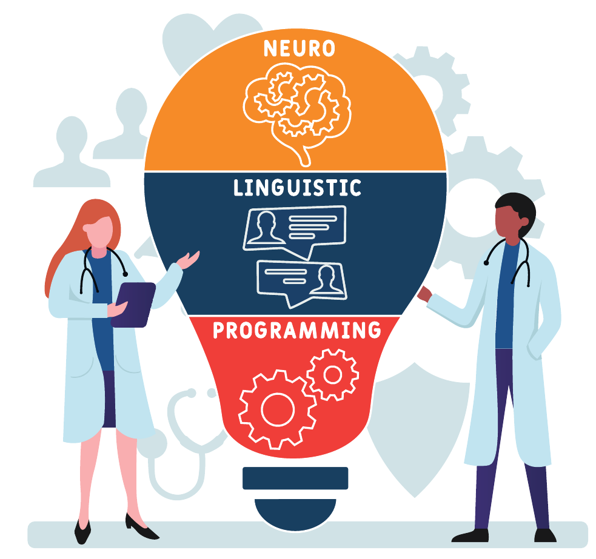
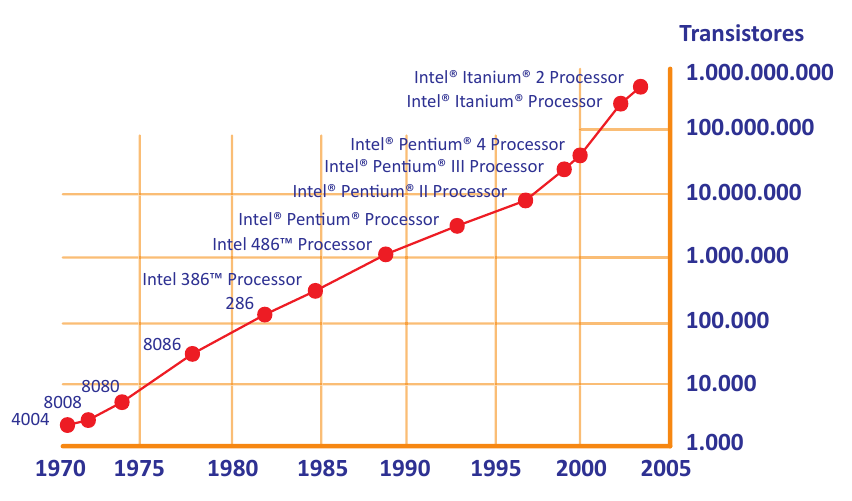
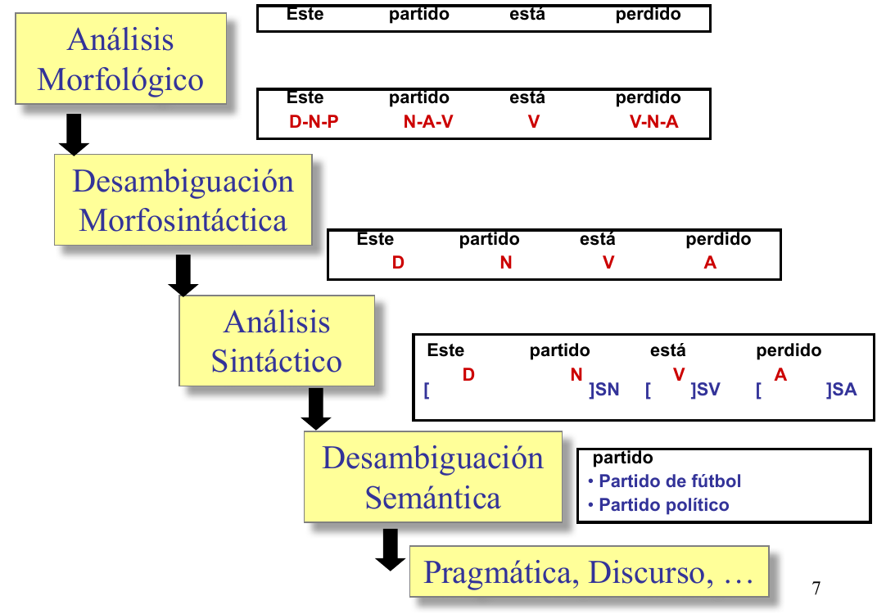
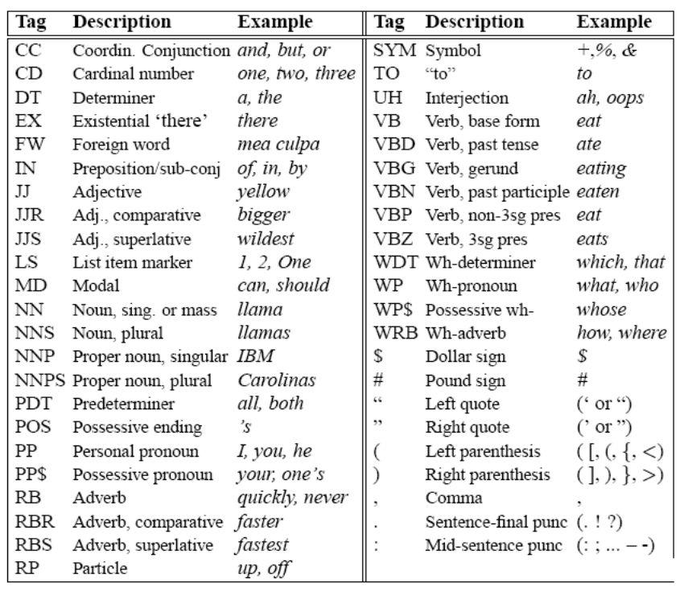
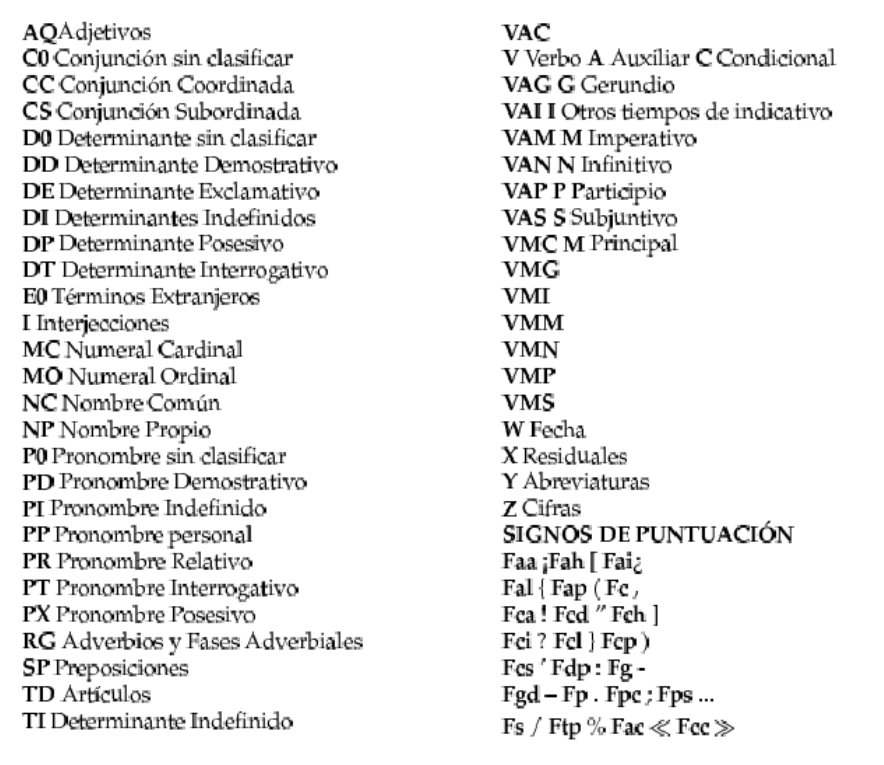

---
marp: true
style: pre.mermaid { all: unset; }
---
<!--
theme: gaia
size: 16:9
_class: lead
paginate: true
marp: false
backgroundColor: #000
backgroundImage: url('img/hero-backgroundIES.jpg')
-->

# **UD03: Procesamiento del Lenguaje Natural**
#### Modelos de Inteligencia Artificial
###### version: 2025-1-20
___
<!-- footer: d.martinezpena@edu.gva.es -->
<!-- header: Modelos de Inteligencia Artificial 24-25 (UD03_1)-->
# ¿Qué veremos?
1. Introducción
2. Técnicas de PLN y Limitaciones.
3. Formación del investigador en PLN
4. Elaboración de un sistema PLN orientado a una tarea específica
___

## Introducción
 El **test de Georgetown** que supuso la traducción automática de unas 60 oraciones del ruso al inglés de manera exitosa.
 
> El procesamiento del lenguaje natural estudia las relaciones del lenguaje entre los seres humanos y las máquinas.
___
El procesamiento del lenguaje natural implica necesariamente de la unión de dos áreas: el área asociada a la máquina y el área relacionada con el ser humano.

___
* **El objetivo general de los sistemas de Procesamiento del Lenguaje Natural (PLN) es el tratamiento de la lengua a fin de ser interpretada y/o producida a la manera en la que lo hacemos los seres humanos (COMPRENSIÓN).**
* Es una tarea de gran complejidad.
___
Un corpus es un conjunto de palabras (un texto) de una lengua y se emplea para formar un diccionario como concepto de conjunto de palabras de una lengua. Diversos métodos de inteligencia artificial emplean corpus para entrenarse.

La gramática de constituyentes/transformacional en sus fundamentos teóricos no emplea predominantemente corpus, que es la llave en la que se basa el aprendizaje máquina para el procesamiento del lenguaje.

Por tanto, la unión de una falta de potencia de cálculo y del tipo de lingüística predominante hasta 1980 marcó el lento desarrollo del procesamiento del lenguaje natural.
___
* Ejemplos de Corpus:
  * como por ejemplo *El Quijote*, o un texto difundido en nuestra lengua, de amplia proyección, como puede ser *La Biblia*.
  * en inglés, existe una base de datos que contiene un conjunto de corpus en esta lengua, que fue realizado en 2014 y recibe el nombre de Gutemberg.
* En el siguiente link se puede ampliar información acerca de la base de datos Gutemberg: https://github.com/pgcorpus/gutenberg
* En el link que aparece a continuación figura uno de los muchos corpus que pueden encontrarse para español: https://github.com/roquegv/spanishNLPModelCorpus
____
Atendiendo a lo expuesto por D. Jurafsky en su texto «Speech and languaje processing», en el estudio de la lingüística de una lengua no solo es necesario llevar a cabo el estudio de las palabras y expresiones regulares del mismo, sino que es preciso estudiar las relaciones generadas por estos cuatro campos: **morfología**, **sintaxis**, **semántica** y **pragmática**.
___
La disciplina que hace uso de sistemas de computación para la compresión y la generación de lenguas naturales es la:
* Lingüística Computacional
* Ingeniería Lingüística
Un lingüista en un proyecto de inteligencia artificial aporta el conocimiento y el enfoque para llevar a cabo exitosamente la programación de las complejas estructuras
**Perro** es la combinación de las grafías «p» «e» «r» «r» «o», que a su vez desde un punto semántico representa el concepto de un animal, y cuya vocal «o» final denota el género de la palabra, que hace referencia al sexo del animal.
___
* **Gramática**: que incluye la morfología, la sintaxis y, para algunos autores, también la fonología.
___
* **Sintaxis**: acorde al texto anteriormente citado de Jurafsky, estudia las reglas y principios que gobiernan la combinación de los constituyentes sintácticos. En el etiquetado sintáctico se adjudica un **POS** (**Part of Speech**); por ejemplo, en español a la palabra *mostrar* se le asignaría la etiqueta **POS** de *verbo*, mientras que en la oración «el niño llora» se etiquetaría lo siguiente:
  * El :arrow_right: Determinante.
  * niño :arrow_right: Nombre.
  * El niño :arrow_right: Grupo sintagmático nominal.
  * Llora :arrow_right: Verbo (y grupo sintagmático predicativo).
___
* Por supuesto, dentro de una etiqueta pueden existir subcategorías, por ejemplo, «niño» es un sustantivo (nombre) de tipo «común» y «el» es un determinante de tipo «artículo».
* Existen herramientas web, como la que figura en el siguiente link, que llevan a cabo el etiquetado y la unificación: https://sintaxis.org/analizador/solucion/
___
* **Morfología**: según Jurafsky, estudia las reglas que rigen la flexión, la composición y la derivación de las palabras. Durante el etiquetado morfológico se determina la forma, clase o categoría gramatical de una palabra. El género de las palabras (masculino y femenino), el número de los nombres (singular o plural), o la persona de las formas conjugadas (primera, segunda o tercera) son ejemplos de este campo.
* El siguiente enlace presenta un analizador morfológico de la Biblioteca Virtual Miguel de Cervantes (BVMC) que usa el [corpus Ancora](https://nlp.stanford.edu/software/spanish-faq.shtml#tagset). https://data.cervantesvirtual.com/analizador
___
- **Semántica**: siguiendo el texto, estudia significado de las expresiones lingüísticas, es decir, las realidades que representan las grafías.
___
- **Pragmática**: se centra en el análisis de la relación del lenguaje con los usuarios y las circunstancias de la comunicación o contexto. El contexto debe entenderse como situación, ya que puede incluir cualquier aspecto extra-lingüístico: la situación comunicativa, un conocimiento popular compartido por los hablantes, relaciones personales, y otros muchos.
___
* RESUMEN:
* **Morfología**: El estudio de la información contenida en una palabra considerada ésta en el contexto en el que se utiliza.
* **Sintaxis**: Estudio de las relaciones estructurales entre las palabras en una frase. Estudio de cómo ordenar y agrupar las palabras en la frase.
* **Semántica**: Estudio de los significados de las palabras y su forma de combinarse para formar significados más complejos.
* **Pragmática**, **Discurso**: Estudia cómo el contexto afecta a la interpretación de las oraciones.
___
### Aplicaciones del PLN
* Reconocimiento automático del habla
* Traducción automática
* Sistemas de diálogo
* Extracción/recuperación de información
* Interfaces en lenguaje natural
* Herramientas para personas con diversidad funcional
* Ayuda a la redacción
___
##  Técnicas de procesamiento de lenguaje. Limitaciones
___
### Potencial del procesamiento del lenguaje natural
Los aspectos fundamentales de las aplicaciones arriba mencionadas son los que se explican a continuación.
___
* #### Reconocimiento del habla (ASR, Automatic Speech Recognition)
* Disciplina encargada de convertir los fonemas emitidos por un ser humano en espectros de ondas de audio captados mediante un dispositivo de entrada de sonido de una máquina que, tras ser procesados dentro del contexto de un modelo lingüístico, den lugar a las grafías escritas del mismo; es decir, los sistemas de las máquinas encargados de convertir la voz captada por medio de un sensor (normalmente un micrófono) en la forma escrita de una lengua.
___
* #### Síntesis de texto a voz (TTS, Text To Speech)
* Estos sistemas hacen la labor contraria a un ASR, es decir, a partir de un texto escrito son capaces de reproducirlo mediante el dispositivo de salida de audio (altavoces). 
___
* #### Detección de entidades nombradas (NER, named entity recognition)
* Consiste en trozear el texto (tokenizar) de tal manera que se detecten las palabras clave. Se trata pues de una labor de extracción de información que localiza y clasifica en categorías (normalmente personas, organizaciones, lugares, y cantidades) las entidades encontradas en un texto.
___
* #### Traducción automática
* Se centra en el desarrollo de sistemas capaces de traducir automáticamente texto o habla de un idioma a otro.
___
* #### Similitud de textos
* Algunos modelos (normalmente de tamaño considerable) han sido entrenados de tal forma que las palabras son etiquetadas de manera que aludan a conceptos semánticos.
* Por ejemplo, un perro es un mamífero y a su vez es un animal. Un etiquetado correcto situará en lugares más próximos entre sí a un perro y a un gato (dos mamíferos) que a un perro y a un salmón. De la misma manera una manzana es una fruta, que a su vez es comida. En buena lógica es más «parecido» semánticamente a una manzana una naranja que una pata de pollo, aunque todo sea comida.
___
* #### Análisis del sentimiento
* El procesamiento del lenguaje natural puede emplear también el etiquetado característico del aprendizaje automático supervisado para entrenar un modelo, de tal manera que sea capaz de captar la positividad o negatividad de un texto en relación con un tema particular.
___
### Limitaciones. La ambigüedad
Una de las limitaciones mayores alrededor del procesamiento de lenguaje natural es la ambigüedad lingüística. Múltiples interpretaciones de una misma palabra pueden arruinar la capacidad de un sistema automático para responder correctamente y desarrollar su función. Los problemas de ambigüedad más comunes en los textos son los siguientes:
___
* **Ambigüedad sintáctica**: se presenta cuando una oración tiene asociada más de una representación sintáctica, es decir, si hay más de una regla gramatical representa dicha oración.
* **Ambigüedad léxica/morfológica** (gramatical): la primera ocurre cuando la duda surge respecto a un término aislado, que admite diversas interpretaciones. La segunda tiene lugar si una palabra que se encuentra en una oración representa más de un rol sintáctico o categoría gramatical dentro de la misma.
* **Ambigüedad semántica**: se presenta cuando afecta a un elemento de la frase que puede ser interpretado de diversos modos.
___
- **Ambigüedad pragmática**: aparece si la realidad depende del contexto del lenguaje y del hablante, en un momento dado. 
- **Ambigüedad fonológica**: se presenta cuando una cadena de sonidos puede resultar confusa.
- **Ambigüedad funcional**: se observa si se emplea un término con doble función gramatical.
___
Ejemplos de **Ambigüedades**
* **Ambigüedad sintáctica:**: Los perros y los gatos enfermos son recogidos por el servicio municipal de recogida de animales. Se podría tener la duda de si son recogidos todos los perros y sólo los gatos enfermos, o si sólo los enfermos (ya sean perros o gatos). Compro los libros baratos. No se puede afirmar si los libros que estoy comprando son los baratos (adjetivo de libros) únicamente, o si estoy comprando libros, que resultan ser baratos (complemento predicativo): http://gedlc.ulpgc.es/investigacion/desambigua/morfosintactico.htm
___
* **Ambigüedad léxica/morfológica**:
 * Usted aquí no pinta nada (no se sabe si se refiere a que no tiene mando o a que no pinta por ejemplo una pared).
 * Pedro y yo escribimos un cuento (no se sabe si lo hemos escrito ya o lo estamos escribiendo porque la forma conjugada puede pertenecer a un presente de indicativo o a un pretérito).
___
* **Ambigüedad semántica:**
  * Pedro quiere pelearse con un italiano (no se distingue si se trata de cualquier italiano o de un individuo concreto).
___
* **Ambigüedad pragmática**: 
  * Golpeó el armario con el bastón y lo rompió (no se sabe si se rompió el bastón o el armario).
___
* **Ambigüedad fonológica**: 
  * «es»-«conde» (puede significar una forma conjugada del verbo esconder o el predicado del verbo ser, o un título nobiliario).
___
* **Ambigüedad funcional:** 
  * He vuelto a oler (antes no tenía olfato y ahora sí; o bien, regresé a un lugar a oler algo para comprobar su aroma).
___
* ## Desambiguación:
* La ambigüedad inherente al PLN es uno de los problemas presentes en todas fases del procesamiento de la lengua.
  * Vino de la Rioja.
  * Compré unos zapatos de piel de señora.
  * La policía observó al sospechoso con unos prismáticos.
  * El pescado está listo para comer.
  * El cura recibió una cura en su habitación.
  * Juan vio a Pedro enfurecido.
___
* continuación...
  * Antonio no nada nada.
  * No puedo ir a la fiesta porque no traje traje.
  * Estaré de vacaciones solo unos días.
  * El Villareal le ganó al Valencia en su campo.
  * Me quedé esperándote en el banco.
___

___
* ## POS Tagging
* El POS Tagging es el proceso de asignar, a cada una de las palabras de un texto, la categoría gramatical. Las palabras, tomadas en forma aislada, en general, son ambiguas respecto a su categoría. La categoría de la mayoría de las palabras se puede desambiguar dentro de un contexto.
  * "Mételo en ese **sobre**" :arrow_right: nombre
  * "Déjalo **sobre** la mesa" :arrow_right: preposición
  * "Dame lo que te **sobre**" :arrow_right: verbo
___
## Categorías Gramaticales (POS)
La elección del conjunto de etiquetas afecta a la dificultad del problema. Hay que llegar a un equilibrio entre:
* Obtener la mayor información posible (etiquetas más específicas)
* Simplificar el trabajo de desambiguación (etiquetas más generales)
___
* Tipos categorías
  * Abiertas o Cerradas
___
* Principales Categorías
  * Nombres (comunes y propios)
  * Pronombres (posesivos, interrogativos, ...)
  * Determinantes (artículos, demostrativos, ...)
  * Adjetivos
  * Verbos
  * Adverbios
  * Preposiciones
  * Conjunciones ...
___
Ejemplos de Etiquetas (POS)

- Penn Treebank: 45
- Brown Corpus: 87
- Susanne: 350
- LexEsp (PAROLE): 250
___
Conjunto de etiquetas **Penn Tree Bank**

___
Conjunto reducido de etiquetas **Parole**

___
## Formación del investigador en PLN
___
* Un experto en sistemas de inteligencia artificial que desee adquirir conocimientos en procesamiento del lenguaje natural puede seguir muchos itinerarios. El aquí propuesto es una ruta tradicional
  * Jurafsky
  * Natural Learning ToolKit (NLTK) en lengua inglesa. A partir de ahí, continuar con 
  * Spacy en lenguas inglesa y española, y finalmente dar el paso a 
  * nVidia NeMo para ejecución de ASR, TTS y NLP en plataformas jetbot
  * y posteriormente entorno de servidores tipo JARVIS/TRITÓN.
___
* **NLTK**: 
  * Cargar un corpus.
  * Usar expresiones regulares.
  * Tokenizar y etiquetar.
  * Emplear lo anterior para hacer etiquetado POS.
  * Usar diccionarios de eliminación de stop-words.
  * Usar N-gramas.
  * Lematizar.
  * Programar un clasificador (por ejemplo, de películas según temática o de noticias).
___
* continuación...
  * Programar un comparador de textos.
  * Programar un analizador de sentimientos.
  * Programar un sistema de ideas clave o resumen.
  * Emplear un TTS (no desde NLTK).
  * Emplear un ASR (no desde NLTK).
  * Programar un procesador semántico real.
___
* **Spacy**: 
  * Vectorización y comparativa por vectorización a partir de modelos pre entrenados disponibles en el programa como los empleados en este texto.
  * Lo mismo con otros modelos entrenados, como variaciones de BERT.
  * Generar un modelo propio de vectorizado por etiquetación.
  * NER, y análisis morfológico con visualización de grafos a través de displacy.
  * Traducción entre idiomas.
___
* **NeMo**:
  * ASR:
    * Detección de voz (Voice activity detection) a través de micrófono
    * Voz a Texto en PC x86, offline.
    * Voz a Texto en PC x86, online.
    * Voz a texto en Jetbot.
    * Comandos de voz (la base para un asistente).
___
  * continuación...
    * TTS.
    * NLP:
      * Lo mismo que en Spacy.
      * Uso del modelo de Megatron.
      * Programar un Q&A tipo Jeopardy.
___
* **jetson-voice**: 
  *  Reconocimiento automático de voz (ASR)
    * Transmisión ASR (QuartzNet)
    * Reconocimiento de comandos/palabras clave (MatchboxNet)
    * Detección de actividad de voz (VAD Marblenet)
___
*continuación...
  * Procesamiento del lenguaje natural (PNL)
    * Clasificación de intención conjunta/espacio
    * Clasificación de texto (análisis de sentimiento)
    * Clasificación de tokens (reconocimiento de entidad nombrada)
    * Preguntas/Respuestas (QA)
    * Texto a voz (TTS)
___
## Elaboración de un sistema de procesamiento de lenguaje orientado a una tarea específica
Se propone aunar todo lo aprendido en la generación de un código que tras adquirir vía ASR la conversación de un usuario con un robot de cocina, sea capaz de hacer que este funcione, teniendo en cuenta las siguientes limitaciones:
___
- El robot puede cocinar mediante calor (cocer). Esta operación requiere de una temperatura en grados Celsius y de un tiempo expresado en minutos, hasta un máximo de 120 °C.
- El robot puede preparar alimentos agitando un instrumento, como por ejemplo batir o remover algo (batir). Esta operación requiere de una velocidad expresada en un valor del 0-10 y de un tiempo expresado en minutos, hasta un máximo de 120.
___
- El robot puede parar (lo cual implica velocidad de giro 0, temperatura 0 °C, tiempo 0).
- El robot ha de poder entender frases alternativas, es decir, en lugar de batir, emplear el verbo remover, o agitar, o uso de verbos generales como «pon el robot a velocidad 5».
- El robot ha de poder entender frases compuestas, que especifiquen en un solo comando temperatura, velocidad y tiempo. 
___
El abordaje de esta labor es sencillo:
1. Un ASR convierte la voz a texto.
2. El texto es procesado:
   - Se quitan las palabras inútiles (stop words).
   - Se unifican mayúsculas, minúsculas y signos.
   - Se tokeniza y se etiqueta.
___
2. continuación...
   - Se localizan los tokens correspondientes a verbos de acción (cocer, batir).
   - Se localizan los tokens correspondientes a valores numéricos.
   - Se va haciendo agregación sintagmática.
   - Se activan las salidas en una GPIO.
<!-- Put this script at the end of Markdown file. -->

